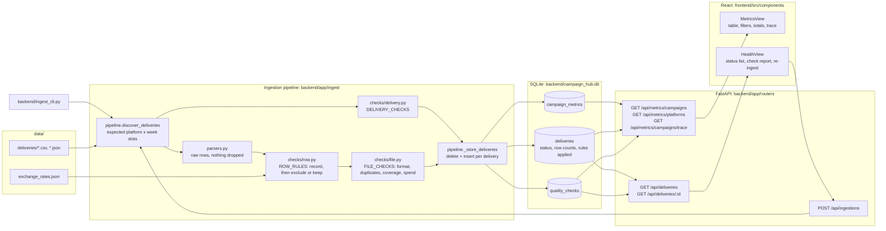

# Campaign Data Hub

Ingests weekly delivery files from Meta, Google and LinkedIn, normalizes them into one campaign-day dataset, and makes both the numbers and how far to trust them visible: a Metrics view, a Data Health view with a per-delivery quality report, and a trace from any campaign's numbers back to the files and transformation rules that produced them.

The core rule of the pipeline: **record every defect, then fix it.** Parsers never drop or coerce anything. Checks log each problem against a named check, with the source line, and only then exclude, normalize or correct the row.

---

## Run it

Needs Python 3.12+ and Node 20+.

```bash
# Terminal 1 - API
cd backend
python3 -m venv .venv && source .venv/bin/activate
pip install -r requirements.txt
python ingest_cli.py              # ingest data/deliveries/ into campaign_hub.db
uvicorn app.main:app --reload     # http://localhost:8000  (interactive docs at /docs)

# Terminal 2 - UI
cd frontend
npm install
npm run dev                       # http://localhost:5173 (proxies /api to :8000)
```

**Ingestion** can be triggered three ways, all idempotent. From `backend/` with the virtualenv active:

```bash
python ingest_cli.py                                  # everything, from the CLI (run it twice: same result)
python ingest_cli.py --dry-run                        # run every check, write nothing

# with the API running:
curl -X POST localhost:8000/api/ingestions            # everything, via the API (or "Re-ingest" in the UI)
curl -X POST localhost:8000/api/ingestions -H 'Content-Type: application/json' \
     -d '{"platform": "Meta Ads", "week_start": "2026-06-08"}'   # one delivery
```

**Tests**, from the repo root after the setup above:

```bash
cd backend
source .venv/bin/activate
pytest -q                          # checks, pipeline and API against the real deliveries

cd ../frontend
npx playwright install chromium    # once
npm run test:e2e                   # seeds the DB, starts API + UI if they aren't running, drives a real browser
```

**New data:** drop files into `data/deliveries/` as `{meta_ads|google_ads|linkedin_ads}_YYYY-MM-DD.{csv|json}` (add `_resend` for a re-delivery) and re-run ingestion. Every platform is expected every week from the first week seen to the last, so a missing file, or a week missing for all platforms, shows up as a failed delivery with no config to maintain. Files that don't match the pattern are listed as ignored.

---

## Architecture



A run reads every file first, because two things span a platform's weeks: campaign name spellings, and the CPM baseline the spend check compares against. It then checks each delivery and writes each one in its own transaction.

### Where each requirement lives

| Requirement | Code | Proven by |
|---|---|---|
| FR-1 canonical dataset | `ingest/parsers.py` → `checks/row.py:coerce_row` → `campaign_metrics` | `test_checks.py` (micros, EUR, dates) |
| FR-2 quality report | `checks/*.py` → `quality_checks` (message, count, affected lines) + row counts on `deliveries` | `test_real_data_defects_are_surfaced` |
| FR-3 health classification | `pipeline.classify_health` | `test_classify_health` |
| FR-4 metrics API | `routers/metrics.py` | `test_api.py` |
| FR-5 data health API | `routers/deliveries.py` | `test_api.py` |
| FR-6 trigger ingestion | `routers/ingestion.py`, `ingest_cli.py` | `test_full_ingestion_is_idempotent` |
| FR-7 metrics view | `components/MetricsView.tsx` | e2e: totals, filter, trace |
| FR-8 data health view | `components/HealthView.tsx` | e2e: counts, check report |
| NFR-1 idempotency | delete + insert per delivery, unique constraints | `test_idempotency`, `test_single_delivery_reingestion_*`, e2e re-ingest |
| NFR-2 error isolation | per-file parse errors, rows excluded not raised, per-delivery transaction | `test_unreadable_file_fails_only_its_delivery`, `test_bad_row_does_not_abort_file` |
| NFR-3 traceability | `deliveries.transformations`, `GET /api/metrics/campaigns/trace`, trace panel | `test_campaign_trace_shows_deliveries_rules_and_notes` |

---

## What I found in the June deliveries

After ingestion: **7 deliveries warn, 1 fails, 7 pass. 367 rows loaded, 10 excluded. Total June spend is $54,277.30.** Without the Meta unit fix it would read $529,546.60.

| Delivery | Defect | Check | What the pipeline does |
|---|---|---|---|
| **Meta 06-08** | **Spend reported in cents.** CPM is $342 against $3.0-3.7 for every other platform-week, impressions and clicks are normal, and every spend value is a whole number (`17334.00`). | spend sanity | Divides by 100 ($480,070 → $4,800.70) and marks the delivery warn with before/after totals |
| Meta 06-01 | `06/31/2026` (App Install Push) | date validity | Row excluded |
| Meta 06-01 | App Install Push has no 06-01 row (the `06/31` row is probably it) | coverage | Reported as a gap. I don't guess the intended date. |
| Meta 06-01 | One row in `YYYY-MM-DD` in an `MM/DD/YYYY` file | date format | Normalized |
| Meta 06-01, 06-15 | `brand awareness q2`, `retargeting - us`, `Lead Gen Webinar  ` (lowercase, trailing spaces) | campaign name | Normalized to the platform's majority spelling |
| Meta 06-15 | 3 rows with a blank `clicks` cell | missing clicks | Stored as `NULL` |
| Meta 06-22 | Summer Sale 06-28 spend `-111.41` | required values, coverage | Row excluded, gap reported |
| Google (all) | `Cost (micros)` | - | ÷ 1,000,000 |
| Google 06-01 | 8 exact duplicate campaign-day rows (43 rows for 35 campaign-days) | duplicate rows | Duplicates dropped |
| Google 06-15 | Two files for one week: original plus `_resend`, byte-identical | duplicate delivery | Warn; only the resend is loaded, so nothing is double-counted |
| LinkedIn (all) | Spend `{amount, currency: EUR}`, dates as epoch ms | - | × 1.08 from `exchange_rates.json`; UTC date |
| LinkedIn 06-08 | 5 records with no `clicks` key | missing clicks | Stored as `NULL` |
| LinkedIn 06-22 | File never arrived | delivery presence | Delivery fails; no knock-on noise from other checks |

I also looked for things that turned out clean: LinkedIn timestamps are all midnight UTC, no campaign disappears from a week, no row has zero impressions or clicks above impressions, and no single row is a CPM or CTR outlier.

`test_real_data_defects_are_surfaced` asserts exactly this table against the real files, so the README and the Health page can't drift apart.

---

## Quality checks

| Level | Check | Triggered outcome | Effect on data |
|---|---|---|---|
| Delivery | delivery presence | fail | - |
| Delivery | duplicate delivery (two files for one week) | warn | resend loaded, original ignored |
| File | file readable (bad JSON, missing columns) | fail | nothing loaded |
| Row | date validity (unparseable or outside the delivery week) | warn | row excluded |
| Row | required values (missing, non-numeric, negative, unknown currency) | warn | row excluded |
| Row | clicks vs impressions | warn | row excluded |
| Row | campaign name (casing, whitespace) | warn | normalized |
| Row | missing clicks | warn | stored as NULL |
| File | date format (rows unlike the rest of the file) | warn | normalized |
| File | duplicate rows (same campaign-day) | warn | duplicates dropped |
| File | coverage (campaign × day gaps; no usable rows → fail) | warn / fail | - |
| File | spend sanity (CPM vs the platform's median over its other weeks) | warn | corrected only for the cents signature |

**Health:** `fail` = nothing usable (missing, unreadable, or no valid rows). `warn` = loaded, but rows were excluded, normalized or corrected, or a value needs review. `pass` = loaded exactly as delivered. Row-level problems don't fail a whole delivery: the rest of the file is still usable, and the report lists every affected line along with rows received / loaded / excluded, which answers "how badly".

### Adding a check

Each level has a registry; nothing else needs to change. Persistence, health classification, the API and the UI pick new checks up automatically.

| Level | Write | Register in |
|---|---|---|
| Row | `def rule(row, context) -> str \| None` (return the issue text) | `ROW_RULES` in `checks/row.py`, with `excludes_row=True/False` |
| File | `def check(rows, context) -> (CheckResult, rows)` (return rows unchanged unless it fixes them) | `FILE_CHECKS` in `checks/file.py` |
| Delivery | `def check(context) -> CheckResult` | `DELIVERY_CHECKS` in `checks/delivery.py` |

`DeliveryContext` carries the platform, week, files, exchange rates, canonical spellings and the platform's median CPM. `test_new_row_rule_needs_no_refactoring` adds a rule exactly this way.

---

## API

| Method | Path | Purpose | Errors |
|---|---|---|---|
| `POST` | `/api/ingestions` | Run ingestion. No body: every delivery. `{"platform", "week_start"}`: that delivery only. Returns rows written/excluded, per-delivery status, ignored files, write errors | 422 invalid or half-specified scope, 404 no such delivery slot |
| `GET` | `/api/metrics/campaigns?platform=&date_from=&date_to=` | Spend, impressions, clicks, CTR, CPC per campaign + totals | 422 unknown platform, bad or reversed dates |
| `GET` | `/api/metrics/platforms?platform=&date_from=&date_to=` | Same, per platform | same |
| `GET` | `/api/metrics/campaigns/trace?platform=&campaign=` | Per-delivery breakdown: file, health, numbers, transformation rules, quality notes | 422 unknown platform |
| `GET` | `/api/deliveries` | Every expected platform-week with status and rows received / loaded / excluded | - |
| `GET` | `/api/deliveries/{id}` | Quality report: every check's outcome, message, count and affected lines, plus the rules applied | 404 |
| `GET` | `/api/health` | API liveness (data health is `/api/deliveries`) | - |

- **Error bodies** are FastAPI's standard shapes, used consistently: `404 {"detail": "Delivery 99999 not found"}`; `422 {"detail": [{"loc": ["query", "date_to"], "msg": "...", "type": "..."}]}`. The reversed-date-range check raises the same validation error type, so clients handle one 422 shape.
- **Edge cases:**
  - `cpc` is `null` when clicks = 0.
  - `ctr` is `null` when no impressions came with a clicks value.
  - Rows without clicks count towards spend and impressions but not towards the CTR/CPC denominators.
  - Filters that match nothing return 200 with an empty list and zero totals; an unknown campaign in a trace returns 200 with no weeks.
  - Platform is an enum, so a typo like `Google` is a 422 rather than a silently empty result.
- Ingestion is synchronous: about 15 files take well under a second, so a job queue would be complexity without benefit at this size.

---

## Key decisions and trade-offs

**Correcting Meta 06-08 instead of quarantining it.** Leaving it in makes June spend 10x wrong. Dropping it leaves a hole in a week where impressions and clicks are clearly fine. The evidence for cents is strong: about 100x CPM on one metric only, and every value a whole number. So the pipeline corrects it, but only when both signals hold (CPM 50-200x the platform median *and* whole-number spend). Any other CPM outlier outside 1/3x-3x is flagged and loaded unchanged. The correction is on record with before/after totals, in the report and in the trace. Once Meta confirms, I'd replace the heuristic with an explicit per-delivery unit override.

**CPM, not week-over-week spend, for the spend check.** Comparing total spend to the prior week breaks on the two-day final week, on budget changes and on missing prior weeks, and it also flags the week *after* an anomaly. CPM against the platform's median over its other weeks doesn't depend on volume, week length or file order.

**Negative spend is excluded, not netted.** It could be a refund or adjustment, but a daily delivery report shouldn't carry one. Excluding it and showing the gap is safer than silently lowering spend.

**Missing clicks are `NULL`, not 0.** Zero would read as "no engagement" and drag CTR down.

**Duplicates.**
- **Two files for a week:** the resend wins, and the delivery is still flagged even when the files are identical, because the platform sent two files.
- **Duplicate rows:** exact duplicates are dropped. A duplicate with conflicting values keeps the first row and is flagged as conflicting; that doesn't occur in this data, and a real feed would need an agreed tie-break rule.

**Storage: SQLite via SQLAlchemy.**
- **Why:** it runs from a fresh clone with zero infrastructure, which the brief requires. 367 rows and 15 deliveries don't need a server.
- **Integrity in the schema:** `UNIQUE(platform, week_start)` on deliveries and `UNIQUE(platform, campaign, date)` on metrics.
- **Portability:** `DB_URL` is configurable and the queries are portable, so Postgres is a config change. Migrations are the part that isn't there yet (see below).

**Idempotency: delete + insert per delivery.** Each delivery's report and metrics are replaced together in one transaction, so a re-run can never leave half-old, half-new results. That's simpler and safer than row-level upserts. A single-delivery re-ingest still reads every file, so it produces exactly what a full run would for that delivery.

**Frontend state.** Each view owns its state with `useState`. The two views share nothing, so a global store or query cache would add indirection without solving a problem.

---

## What I would do with more time

In priority order, with the reason each matters:

1. **Explicit unit overrides instead of the cents heuristic.** A small, reviewed config (`meta_ads 2026-06-08: spend_divisor 100, confirmed by …`) recorded in the delivery's rules. Heuristics that change money should graduate to decisions someone signed off.
2. **Ingestion run history.** A `runs` table (who, when, which files, file hashes, per-delivery outcome) with a "what changed since the last run" view. Today a re-run replaces results with no audit trail of what the previous run said.
3. **Schema migrations (Alembic).** The schema is created with `create_all`, so a column change means recreating the database. That's fine for a fresh clone, not for a system with history.
4. **Richer baselines.** Per-campaign rolling CPM and CTR baselines instead of one platform median, so a single campaign going wrong inside a healthy file is caught.
5. **Daily FX rates.** One fixed EUR rate for the whole month is what finance supplied, but real spend should convert at each row's date.
6. **Async ingestion + auth.** Move `POST /api/ingestions` to a background job returning `202` with a run id once volumes grow, and protect it; right now anyone who can reach the API can trigger it.
7. **Confirm LinkedIn's reporting timezone.** Dates are taken as UTC; all timestamps are midnight UTC today, but that's an assumption worth confirming with the account.
8. **`docker-compose.yml`.** Deliberately deferred in favour of the functional requirements; the README setup is two commands per side.
